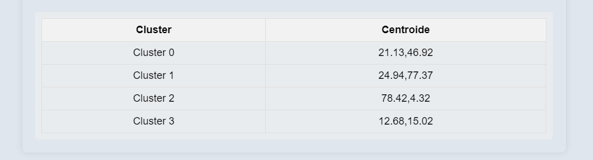

# Manual de Usuario - Modelos de Machine Learning

## LABORATORIO DE INTELIGENCIA ARTIFICIAL 1 - PROYECTO 2
### 201709051 - Heidy Beatríz Miranda Gámez

## Índice
1. [Regresión Lineal](#regresion-lineal)
2. [Regresión Polinomial](#regresion-polinomial)
3. [Árbol de Decisión](#arbol-de-decision)
4. [Naive Bayes](#naive-bayes)
5. [Redes Neuronales](#redes-neuronales)
6. [K-Means](#k-means)
7. [K-Nearest Neighbor](#k-nearest-neighbor)

---

# Pagina Principal

# Seleccion de Modelo

--

## 1. Regresión Lineal

### Descripción
La regresión lineal es un modelo que predice un valor continuo a partir de una o más variables independientes. Se basa en la relación lineal entre las variables.

### Uso
1. Cargue sus datos en formato CSV o JSON.
2. Entrene el modelo haciendo clic en el botón de entrenamiento.
3. Realice predicciones ingresando nuevos valores.
4. Visualice los resultados en tablas y gráficos.

### Parámetros Clave
- **Tasa de aprendizaje:** Controla el ajuste del modelo.
- **Número de iteraciones:** Determina cuántas veces se entrenará el modelo.
- **Porcentaje de entrenamiento:** Porcentaje de datos para entrenamiento.
- **Valor de entrada:** Valor para realizar la predicción.

---

## 2. Regresión Polinomial

### Descripción
La regresión polinomial extiende la regresión lineal al utilizar funciones polinómicas, permitiendo modelar relaciones no lineales entre variables.

### Uso
1. Cargue sus datos en formatos CSV o JSON.
2. Seleccione el grado del polinomio.
3. Entrene el modelo y realice predicciones.
4. Visualice los resultados en tablas y gráficos.

### Parámetros Clave
- **Grado del polinomio:** Determina la complejidad del modelo.
- **Valor de entrada:** Valor para realizar la predicción.

---

## 3. Árbol de Decisión

### Descripción
El árbol de decisión clasifica o predice valores utilizando una estructura de árbol basada en características de los datos.

### Uso
1. Cargue los datos desde un archivo CSV o JSON.
2. Entrene el árbol de decisión.
3. Realice predicciones y visualice el árbol.

### Parámetros Clave
- **Datos de entrada:** Datos necesarios para entrenar el modelo.
- **Resultado de la predicción:** Resultado basado en los datos ingresados.

---

## 4. Redes Neuronales

### Descripción
Las redes neuronales predicen relaciones entre dos números, utilizando dos redes para determinar la probabilidad de que sean diferentes o iguales.

### Uso
1. Ingrese dos números en los campos designados.
2. Realice predicciones sobre la igualdad o diferencia de los números.

### Parámetros Clave
- **Números de entrada:** Números que se utilizarán para las predicciones.

---

## 5. Naive Bayes

### Descripción
Naive Bayes es un conjunto de algoritmos de clasificación que asume la independencia entre características y se basa en el teorema de Bayes.

### Uso
1. Cargue los datos desde archivos CSV o JSON.
2. Seleccione la variable objetivo y las causas.
3. Realice predicciones y visualice los resultados.

### Parámetros Clave
- **Variable objetivo:** La variable a predecir.
- **Causas:** Conjuntos de características que afectan a la variable objetivo.

---

## 6. K-Means

### Descripción
K-Means es un algoritmo de agrupamiento que clasifica datos en grupos basándose en similitudes entre ellos.

### Uso
1. Cargue los datos en formato CSV o JSON.
2. Ejecute el algoritmo K-Means para clasificar los datos en clusters.
3. Visualice los resultados en una tabla y gráfico.

### Parámetros Clave
- **Número de clusters:** Número de grupos en los que se desea clasificar los datos.

---

## 7. K-Nearest Neighbor

### Descripción
K-Nearest Neighbor es un algoritmo de clasificación que predice la clase de un punto basándose en las clases de sus vecinos más cercanos.

### Uso
1. Cargue los datos en formatos CSV o JSON.
2. Entrene el modelo y realice predicciones basadas en nuevos datos.
3. Visualice los resultados en tablas y gráficos.

### Parámetros Clave
- **Número de vecinos:** Determina cuántos vecinos considerar para la clasificación.

---

Este manual proporciona una guía básica sobre cómo utilizar los modelos de Machine Learning implementados en Tytus.js. Asegúrese de seguir las instrucciones específicas para cada modelo para obtener los mejores resultados.

